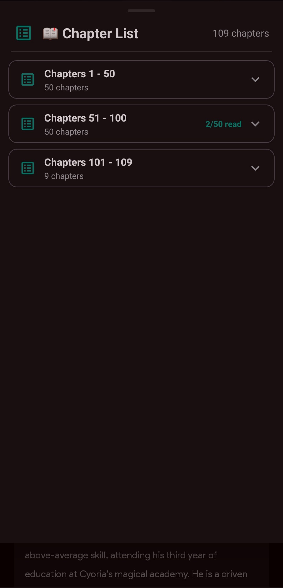
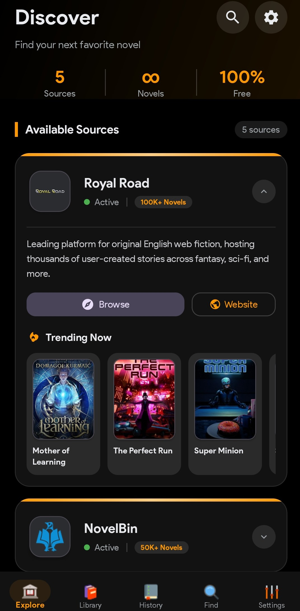
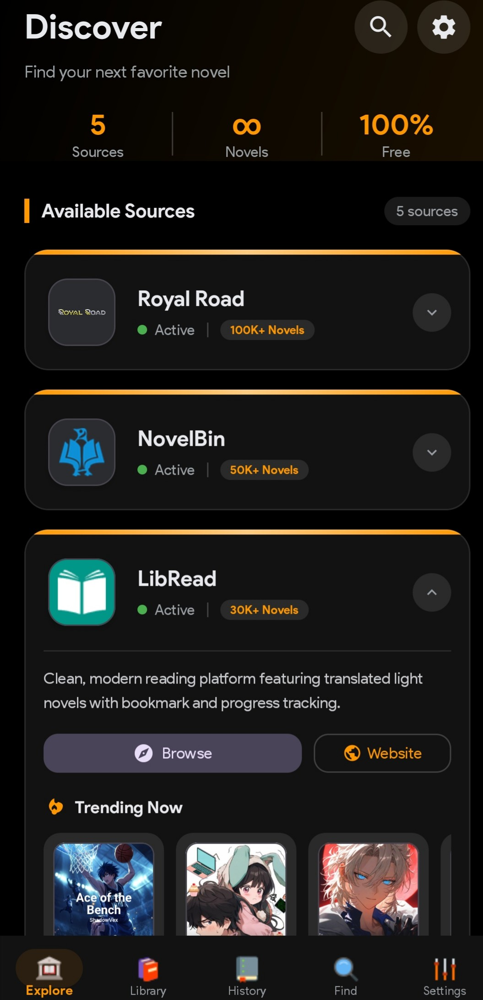
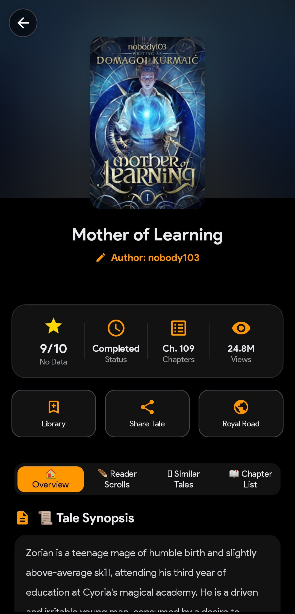
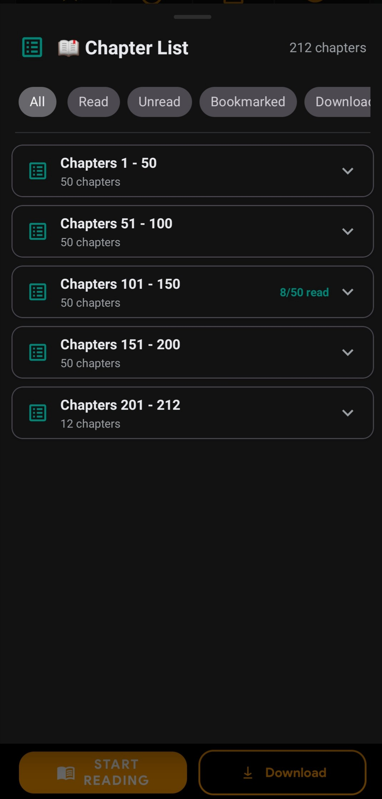
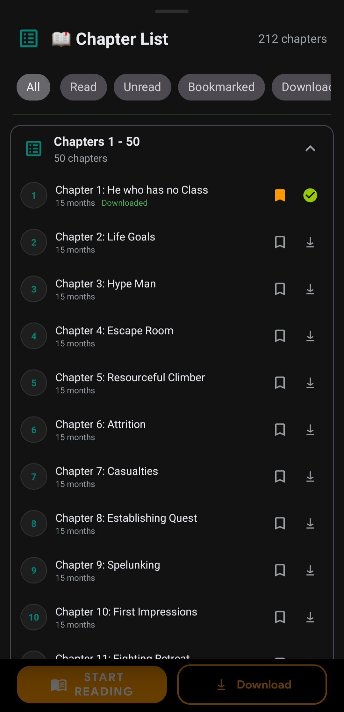
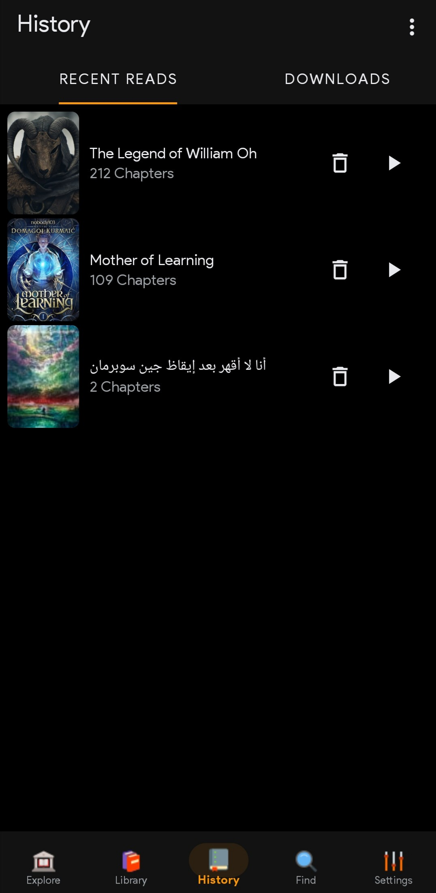

  

<h1 align="center">NovelGrimoire</h1>

  <strong>📚 The Ultimate Novel Reading Experience for Android</strong>

  
  
  
  

  
  

---

## Release v1.1

- Download: https://github.com/AkuFtw472/MyNovelGrimoire/releases/tag/v1.1
- Highlights:
  - Multiple novel sources
  - Custom reader (fonts, colors, themes)
  - Offline reading + Text-to-Speech

## ✨ Features

| Feature | Description |
|---------|-------------|
| 📖 **Multiple Sources** | Access novels from 10+ popular websites in one app |
| 🎨 **Custom Reader** | Personalize fonts, colors, themes, and reading modes |
| ⬇️ **Offline Reading** | Download chapters to read without internet |
| 🔊 **Text-to-Speech** | Listen to novels with built-in TTS support |
| 🔖 **Bookmarks** | Save your favorite chapters for quick access |
| 📚 **Library** | Organize novels with categories and reading progress |
| 🌙 **Dark Mode** | Easy on the eyes with beautiful dark themes |
| 🔄 **Auto Updates** | Get the latest features automatically |
| 🌍 **Multi-Language** | Support for English and Arabic novels |

---

## 📱 Screenshots

  
  
  

  
  
  

  
  
  

---

## 📦 Installation

### Method 1: Direct Download
1. Download the latest APK from [**Releases**](https://github.com/akuftw/NovelGrimoire/releases/latest)
1. Download the latest APK from [**Releases**](https://github.com/AkuFtw472/MyNovelGrimoire/releases/tag/v1.1)
2. Enable "Install from unknown sources" in your device settings
3. Open the downloaded APK and install
4. If Google Play Protect shows a warning, tap **"More details"** → **"Install anyway"** (the app is safe, just not from Play Store) or just tap **"scan the app"**
5. Enjoy reading! 📚

### Method 2: Auto-Update
The app includes automatic update checking. You'll be notified when a new version is available.

---

## 📚 Supported Sources

| Source | Language | Status |
|--------|----------|--------|
| Royal Road | English | ✅ Working |
| NovelBin | English | ✅ Working |
| LibRead | English | ✅ Working |
| FreeWebNovel | English | ✅ Working |
| ScribbleHub | English | ✅ Working |
| ReadNovelFull | English | ✅ Working |
| Miracle Novel | Arabic | ✅ Working |
| + More... | Various | ✅ Working |

---

## 🔧 Requirements

- **Android Version:** 5.0 (Lollipop) or higher
- **Storage:** ~50MB for app + space for downloads
- **Internet:** Required for browsing (offline reading available)

---

## 📞 Support & Community

- 💬 **Discord:** aku.ftw
- ☕ **Ko-fi:** [Support the Developer](https://ko-fi.com/akuftw)
- 🐛 **Bug Reports:** [Open an Issue](https://github.com/AkuFtw472/MyNovelGrimoire/issues)
- 💡 **Feature Requests:** [Discussions](https://github.com/AkuFtw472/MyNovelGrimoire/discussions)

---

## ⚠️ Disclaimer

NovelGrimoire is a reading application that aggregates content from various public sources. We do not host any content. All novels and their rights belong to their respective authors and publishers. Please support the original creators when possible.

---

  Made with ❤️ for novel readers everywhere

  <strong>⭐ Star this repo if you find it useful!</strong>

